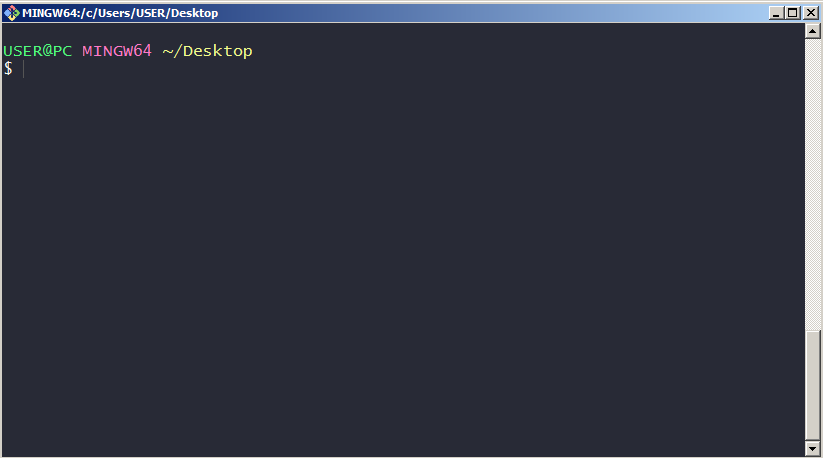
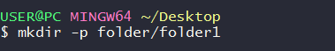
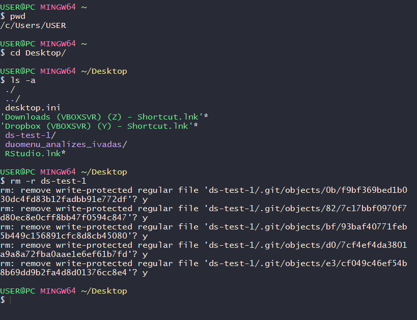

```{r setup, include=FALSE}
knitr::opts_chunk$set(echo = TRUE, error = TRUE, cache = TRUE, collapse = TRUE)
```

# Introduction
This book is for students studying *Introdution to data analysis* at *Vilnius Univeristy* as accompaniying literature for the lectures.

Though lectures may be held in native tongue, lithuanian language is poor in regards to IT terminology. The anglicisms needed are so frequent, that I decided to *qeep it simple* and write this book in the lingua franca - english.

Prerequisites for students thus are: 

* fluency in english
* computer or notebook with an internet connection and administrator rights to install and run programms on that computer
* willingness to engage with programing / coding, but ***no*** formal background in programming is required 
* some basic understand in mathematics / statistics

## Contents

The first part of this book introduces students to some basic computer techniques:

* *command-line interface*, 
* text editors
* *Git* and *Github*.

These techniques are very important in every day life of a data scientist in generall or an economist in particular, as they simplify the workflows and allow for a more subtile way of dealing with files, folders and backups.

The second part of the book introduces to R and R studio. With the emphasis in reading in data, manipulating the imported data and reporting summaries of the data. Third part introduces to functions, that allow the students to write their own functions. Students are introuced with `tidyverse` universe, (packages like `dplyr`, `ggplot`) as tool simplyfiying data analysis

Third part of the book introduces to different statistical data sources

Fourth part of the book introduces to exploratory data analysis

Final part of the book deals with tools of reproducible research: Rmarkdown, LaTex. But topics such as bibliography software Jabref and mendeley are covered.

## Notation
This book is written in RMarkdown and allows the writer to include code chunks for multiple programming languges, amonge others: Bash and R (unfortunately not Git yet). Code chunks are reproducible and their output is the one (or similar) to one that students should receive if copying the code on their mashines.
Notation of the code inside code-chunks.

* \# at the beginning of the line indicates a comment
* \## is the product of code evaluation

Example

```{r}
# This is a comment
# Assigning value of 2+2 to an object x
x <- 2+2 
print(x) # everything to right of # is not evaluated by R, RMarkdown, thus a comment

```


# Toolbox

## Command-line interface

["In the Beginning was the Command Line"](https://www.learnenough.com/command-line-tutorial/basics) as Neal Stephenson called his essay, discussing why why the proprietary operating systems business is unlikely to remain profitable in the future because of competition from free software. 

Command-line interface (CLI) has the advantage of beeing far more flexible then most graphical user interface (GUI) programms to interact with the computer. User of the computer can type commands that then are evaluated by the computer. A typical example of a command is 

```{bash, eval=TRUE}
echo "Hello World"
```

This part of the book covers the basics of the Unix command line. [Unix](https://en.wikipedia.org/wiki/Unix) is a family of operating systems such as Linux, Andros, iOS, macOS. For MS Windows users, I suggest either to run a Virtual Mashine with Linux or install [Git Bash](https://git-scm.com/downloads). 
Note: sometimes CLI commands and outputs might differ if run on Windows compared to ones run on Unix systems.


### Software

### Starting CLI

#### Terminal

Command line can be typed in terminal. To start terminal, start Git Bash on Windows, terminal on Linux systems.



In such a terminal window commands can be typed. An example of a command is 



Every command line starts with a symbol or symbols "prompting" user for action. Usually promt ends with an `$`. Seeing the promt sign means, the user can enter a command, else, user has either to finish entering a command ot wait until the previous command has been finished running.

A typical command conists of a command, an option (flag) and further arguments. 
```{bash, eval=FALSE}
mkdir -p folder/folder1

# here the mkdir is a command creating a folder
# -p is a flag meaning parental making first part of the argument the parental folder and second the child folder
# folder/folder1 is the argument that is beeing used, so the names of folders to be created
```

#### Execercises
1. Install and run *Git Bash* if running a Windows OS, or start terminal in Linux or Mac.
2. Identify promts, commands, flags (options) ar arguments:



Note here, sometimes when trying to remove  write-protected files, command line might ask you, if you really wo want to remvoe them. Then a `y` or `yes` has to be typed (followed by an `enter`), before the files a deleted. 

### First command
The usual first command in any computer language is the "Hello World". Here we promt the compter to print out the "Hello World" with the command `echo` followed by the charackter string argument `Hello World`. The printing happens in `standard out` (ussually just the screen). Note that after evry printing out, command line interface returns back a promt, allowing entering another command. 

```{bash, collapse=TRUE, eval=FALSE}
$ echo "Hello world"
Hello world
$ echo 'Hello world'
Hello world
$ echo Hello world
Hello world
```
Note, that command `echo` takes a charackter string argument, which can be wrapped in single, double or no quotation marks. Though I would allways suggest to use quatation marks for any charckter string argument.

If a user hits the return (enter) key, before finishing to enter the charackter string  (user started to enter it with a double quatation mark but did not finish it), CLI would print a `>` sign, to promt user to finish the command.

```{bash, collapse=TRUE, eval=FALSE}
$ echo "Hello world
>
```

In such case, user has two choises: either to to type `"` or hit `CTRL+C` to cancel the command.

```{bash, collapse=TRUE, eval=FALSE}
$ echo "Hello World
> "
Hello World
```

#### Exercises
1. Write a command that prints out "Hello, my name is..." with your name instead of dots in 3 different ways.
2. Type the command `"echo my name is` with only one quotation mark at the beginning and then get out of trouble described above.
3. Type `cat` or `tail` commands, hit enter and then get out of trouble described above.


### Manual pages
Very useful tool in dealing with command-line is the usage of command `man` that prints out the manual page of a command. Because `man` is command itself, one can call man on man `man man`. It is a very good practice, before staring using any command on CLI to briefly scan the man outpout of a command `man <command>`, as it gives some insights what are the specifications possible. In some cases it might be of crucial importance, as the differences on different operating systems might varry.

NOTE: `man` does not work in Git Bash on Windows! On Windows (and Linux systems) use `help <command>`, for a shorter output, mainly a help page, that contains the essence of man page. In some cases `help <command>` will not work. In such cases try out `<command> --help`

```{bash, collapse=TRUE, eval=T}
help echo
```


```{bash, collapse=TRUE, eval=T}
sleep --help
```


Fore sure, `man` page will not solve any problems, one can encounter with while working, in such cases, one can try this approach 


Though probably four other suggestions are missing here
* Have you tried to restart the application?
* Have you tired to reboot the operating system?
* Have you tried to reintall the application?
* Have you tried to reinstall the OS?

### Navigation in CLI
Navigating and editing in CLI accuallty does not require the usage of a mouse.

* Side arrows ← →  allow for  moving within  the code line
* Up and down  arrows ↑ ↓   moving between  the  already typed in commands
* `Crtl+A` performs the same as `Home` key, it jumps the cursor to the beginning of the line
* `Crtl+E` performs the same as `End` key, it jumps the cursor to the end of the line
* `Crtl+U` deletes everything on the line to the left of the cursor position

Sometimes it is usefull to clean the CLI from to much output. In such cases enter the command `clear` or use the shortcut `Crtl+L`. This command only clears the visible history, but does not delete the history of commands, that still cann be accessed by arrows.

History of all commands typed in can be accessed by typing the command `history`.


#### Exercises
1. Type onces the command `echo "First"` and then only using the keyboard arrows, without retyping `echo` type:
    * "Second"
    * "Third"
    * "Fourth"
2. Type
    *  `echo "an arrow up↑"`
    *  `echo "an arrow down↓"`
    *  `echo "an arrow left ←"`
    *  `echo "an arrow right →"`
Your keyboard can not produce the arrows, so search for them on internet, for example on search engine [DruckDuckGo](https://duckduckgo.com/?q=unicode+character+arrow&t=canonical&atb=v158-3__&ia=web), then copy them into CLI. 
Given that `Ctrl+C` is already researved for canceling the commands, find a way how to use the ussual keyboard shortcuts to copy, cut and paste (`Ctrl+C`, `Ctrl+X` and `Ctrl+V`) in CLI (Use internet!)
3. Type `clear` and then using the arrows and enter key reprint the `echo "First"` command
4. Type `help history` and find how to delete the history of all entries. Delete all entries and check that arrows do not allow for retrieving any commands entered before.
5. Exceute the command to sleep for 5 seconds. Wait and see how after the 5 seconds CLI returns the promt back.
6. Exceute the command to sleep for 36000 seconds. You probably realize, that that is equal to 10 hours. Get out of trouble!


### File manipulation

One of the most imporant tasks of using CLI is the manipulation of files and folders.
#### Redirtecting and appending
Command `echo` prints out the charackter string following the command. The next exmaples will utilise the [Lorem ipsum](https://lipsum.com/) generated text.

```{bash, collapse=TRUE, eval=T}
echo "Lorem ipsum dolor sit amet"
```

Instead of print out the text on the "standard out" (screen), one can print out the text into a file. This can be acieved by using the *redirector operator* `>`. 

```{bash, collapse=TRUE, eval=T}
echo "Lorem ipsum dolor sit amet, consectetur adipiscing elit." > lorem1.txt
```

Command `cat` (short for "concatenate") dumps the contents of a selected file on the screen. Or concatenates the contants of multiple files and prints them out.

```{bash, collapse=TRUE, eval=T}
cat lorem1.txt
```

Creating the second sentence of Lorem ipsum into a file "lorem2.txt" and then printing out the concatenation of both files:
```{bash, collapse=TRUE, eval=T}
echo "Etiam tempus magna id rutrum sodales." > lorem2.txt
cat lorem1.txt lorem2.txt
```

Note, the *redirector operator* overwrites the existing file. So one has to be cautios, as CLI does not warn about a file beeing overwritten! 
```{bash, collapse=TRUE, eval=T}
echo "Lorem ipsum dolor sit amet, consectetur adipiscing elit." > lorem1.txt
cat lorem1.txt
```

```{bash, collapse=TRUE, eval=T}
echo "check." > lorem1.txt
cat lorem1.txt
```

If one intends to append the first first created file. One can use the *append operator* `>>`
```{bash, collapse=TRUE, eval=T}
echo "Lorem ipsum dolor sit amet, consectetur adipiscing elit." > lorem1.txt
echo "Etiam tempus magna id rutrum sodales." >> lorem1.txt
cat lorem1.txt
```

CLI has a command to compare similar but different files. The command `diff`. For this example another version of lorem is created.
```{bash, collapse=TRUE, eval=T}
echo "Lorem ipsum dolor sit amet, consectetur adipiscing elit." > lorem3.txt
echo "Etiam Tempus Magna Id Rutrum Sodales." >> lorem3.txt
```

And two files compared. So in the lorem1.txt file, all first letters are lower-case, and in the lorem_3.txt file, in the second line all first letters are upper-case. CLI prints out only the lines with differences, so here only the second line

```{bash, collapse=TRUE, eval=T}
diff lorem1.txt lorem3.txt
```

#### Exercises
1. Go to [Wikipedia](https://en.wikipedia.org/wiki/Tauti%C5%A1ka_giesm%C4%97) or other source, to find the national anthem
2. Using the `echo` command and `>` redirector operator create 4 files for each verse of the Lithuanian anthem naming them "lt_anthem_1.txt", "lt_anthem_2.txt","lt_anthem_3.txt","lt_anthem_4.txt". You will probably encounter a problem when creating the fourth verse. Think how can you prevent the problem.
3. Replicate the first verse `lt_anthem_1.txt` to `lt_anthem_1_copy.txt` using one of CLI commands instead of retyping the verse! Hint: think in a following way: you want to print out the contents and the printout should be redirected to a copy file
4. Call `diff` on `lt_anthem_1.txt` and `lt_anthem_1_copy.txt`. If CLI does not return anyything, it means, there are no differences.
5. Using command `cat` create full Lithuanian anthem and write it to a file `lt_anthem.txt`
6. Print out the anthem

### Listing

One of the most important CLI commands is the command `ls` (= list). Run `ls` on CLI. The output will greatly vary, and the files in working directories do vary as well.

```{bash, collapse=TRUE, eval=TRUE}
ls
```

`ls` list all the files and directories (folders) in the current (working) directory. Run `ls --help` to check for possible flags for this command.

`ls` command can be checked if a specific files does exist.
```{bash, collapse=TRUE, eval=TRUE}
ls foo.txt
```

The command `touch` creates any empty file. In this case a "foo.txt" document. One can also create empty .R, .csv, etc files.
```{bash, collapse=TRUE, eval=TRUE}
touch foo.txt
ls foo.txt
```

`ls` supports *wildcard character* `*` (=star). For example one can list all files, that are ".txt" files in the directory. So `*.txt` means  - "anything" that is followed by .txt.
```{bash, collapse=TRUE, eval=TRUE}
ls *.txt
```

There are multiple flag arguments for the `ls` command, but main ones are

* `ls -l` list in long form (printing out date and time of the last modification. The size of the files is in bytes).
* `ls -rtl`  list in long form, but with reversed time ("reversed time of modification long format").
* `ls -a` list including the hidden files (in Unix systems indicated by a . before the file name, example `.gitignore`)
* `ls -lh` where "h" stands for human readable. File sizes are converted
* Note, that `ls -rtlha` is the same as `ls -r -t -l -h -a`

#### Exercises
1. What is the command to list all non-hidden files that start with the letter "l"?
2. What is the command to list all files in long form  by reverse modification time, that contain "anthem" in their name?
3. Create a hidden file `.gitignore` with the follwoing command `echo "*.foo" > .gitignore`. Check the results of `ls -l` and `ls -al` for differences.

### Renaming, copying, deleting

Renaming of a file can be acieved by calling the command `mv` ("move"). The move command takes the file and renames the selected file.
```{bash, collapse=TRUE, eval=TRUE}
echo "test text" > test.txt 
ls
```

```{bash, collapse=TRUE, eval=TRUE}
mv test.txt test_1.txt
ls
```

But one can also literally move the file to anothe directory with or without renaming it

Command `cp` creates a coppy of a file.

```{bash, collapse=TRUE, eval=TRUE}
cp test_1.txt test_2.txt
ls
```

Command `rm` removes files
CLI might ask if you want to remove a file "removetest_1.txt?", then type "y" or "Y" and hit return key. If you want to supress such calls, use the flag `-f` example `rm -f <argument>`
```{bash, collapse=TRUE, eval=TRUE}
rm test_1.txt
ls test_1.txt
```

Remove also works with wild cards. Here the command remvoes all `.txt` files in the directory.
```{bash, collapse=TRUE, eval=TRUE}
rm *.txt
```

Caution: `rm` removes files completely from the system. Deletion is irreversible, as the deleted files are not staged into the "Recicle Bin". 

#### Exercises
1. Using `echo` and `>` create `foo.txt` containing "Hello World"
2. Using `cp` create a copy of `foo.txt` and nameing it `bar.txt`
3. Using `diff` confirm there are no differences.
4. Using `cat` and `>` create a copy of `foo.txt` and naming it `baz.txt`
5. Using `diff` confirm there are no differences.
6. Create a file `tux.txt` containgin the contents of `foo.txt` and `bar.txt`
7. How do `rm nonexistent` and `rm -f nonexistent` differ for a nonexistent file? 

### Downloading a file

Command `curl` allows to interect with the URL at the CLI. 
To check if `curl` is available on the system, run command `which`. If no location is beeing printed, install `curl`. 

```{bash, collapse=TRUE, eval=TRUE}
which curl
```


Next commend uses the `curl` command to conntext to an URL and read the data.
The flags used here:
 * `-O` (capital O, not a zero) Writes output to a file named as the remote file (pg.330.txt)

```{bash, collapse=TRUE, eval=TRUE}
curl -O http://www.gutenberg.org/cache/epub/3300/pg3300.txt
```

If one wants to write the data into a specific file "asmith.txt" following flags would work as equally well
* `curl http://www.gutenberg.org/cache/epub/3300/pg3300.txt -o asmith.txt`
* `-o` (lowercase o) follwed by the file name
* `curl http://www.gutenberg.org/cache/epub/3300/pg3300.txt > asmith.txt`
```{bash, collapse=TRUE, eval=TRUE, include=FALSE}
rm -f *.txt
curl http://www.gutenberg.org/cache/epub/3300/pg3300.txt > asmith.txt
```

### Repeating previous commands

* It is sometimes cumbersome so repeat previous commands. The `!!` does exaclty that. it simply calls the previous comand and exceutes it again. 
* If you want to repeat last comand, that started with c, you can enter `!curl`, `!cu` or even `!c` 
* Another tool in repeating commands is the reverse search within the CLI. Hit `Crlt+R` and start typing the command you want to repeat, once found, hit return key.


#### Exercises
1. What does the flag `-I` in `curl -I`?
2. Run `curl -I www.lithuanian-economy.net`
3. using `ls` confirm that `asmith.txt` does exist in working directory.
4. What size in megabytes is the `asmith.txt`? 

###`head` and `tail`

Command `head` prints out the first 10 lines of a file

```{bash, collapse=TRUE, eval=TRUE}
head asmith.txt
```

Command `tail` prints out last 10 lines of a file

```{bash, collapse=TRUE, eval=TRUE}
tail asmith.txt
```

Command `wc` ("word count") counts
 * lines 
 * words 
 * bytes
in the file

```{bash, collapse=TRUE, eval=TRUE}
wc asmith.txt
```

### Pipes
Sometimes we want to combine different CLI commands, so that thei do run in sequence. For instance, we could run
```{bash, collapse=TRUE, eval=TRUE}
head asmith.txt > asmith_head.txt
wc asmith_head.txt
```

But other, more efficient way is to pipe the commands. `<command 1> | <command2>`. The pipe symbol `|` is a vertical dash (`Shift+backslash`)

```{bash, collapse=TRUE, eval=TRUE}
head asmith.txt | wc
```

#### Exercises
1. Using piping confirm that `head asmith.txt` and `tail asmith.txt` contain only 10 lines
2. Using `head --help` find a way to print more or less lines. Try printing 30 lines.
3. Using piping and different `head` and `tail` lenghts print the 10th line of asmith.txt? What is this line?
4. The ping command "pings"" a server.  In one CLI windows enter following command `ping www.lithuanian-economy.net > ping.txt` (for Unix systems) and `ping -t delfi.lt >ping.txt` for Windows. In unix ping command untinues until it is canceled with `Ctrl+C` in windows such behaviour is acheveved by passing the flag `-t`. See [Web](https://www.computerhope.com/pinghlp.htm) or `ping --help`.
In the other CLI window open the file `ping.txt` with the `tail-f` command. the `-f` flag allows for "following" the file
(does not print the current tail, but updates the tail continuously). Quit both commands with `Ctrl+C`

### less
`less` is a powerful tool to have a look into a text file. One navigates with arrows up and down, with `Ctrl+F` [or space key] and `Ctrl+B` one can change pages (forward / backward) . `q` quites the `less`.
`/` (a formard slash key) allows for search in a file. For example tuping `/Wealth` find the next `Wealth` occurance and marks it. To find ne next occurence, hit `n` key, or to find the previous occurence the `N` key. Seach is case sensitive.

#### Exercises
1. Open `asmith.txt` with `less`. Go 5 pages down and 5 pages up. Go to the bottom of the file and back to the top.
2. Search for `lodge`. What is the first sentence containig the word? How many lies do contain the word lodge in the  text? Compare mannual counting to results of the follwoing command (in separate CLI window) `grep Wealth asmith.txt |wc`
3. Pipe `curl --help` to `less`. Search for `-O` then for `-o`

### Grepping
Grep stands for "globally search a regular expression and print".  In CLI `grep` finds a character string and prints the line containing character string.

```{bash, collapse=TRUE, eval=TRUE}
grep " Wealth" asmith.txt
```
Note : in order to search for a single word  use `" Wealth"` with spaces before the word

Forwaring this command to `wc` counts for all words in the grepped lines

```{bash, collapse=TRUE, eval=TRUE}
grep " Wealth" asmith.txt |wc
```

But one can imagine, that the world lodge could be written as well with the captial L (Lodge). Open the `--help` function of `grep` by forwarding it to `less` and then searching for term `case`.
```{bash, collapse=TRUE, eval=TRUE}
grep  -i " Wealth" asmith.txt |wc
```
compare to results:
```{bash, collapse=TRUE, eval=TRUE}
grep  -i "Wealth" asmith.txt |wc
```
which might include such word as "commonwealth".

Grep in CLI does not support all usuall formats of regex [https://regex101.com/](https://regex101.com/). Thus its is better to do grepping in *R* or text editors like *Sublime*.

#### Exercises

1. Search in `grep --help` for "line number". Constructy a command to find the line numbers in `asmith.txt` where `wealth` appears. 
2. By using `grep` and `head` print out the first 15 lines with numbering that contain the world wealth (explicit lower case w)
3. How many lines do contain words wealth and society? How many lines do contain words wealth and poverty? 


### Grep

```{bash, collapse=TRUE, eval=TRUE}
# cd text_files/
# mkdir foo
# cd foo/
# echo sesquipedalian > long_word.txt
# cd
```


```{bash, collapse=TRUE, eval=TRUE}
# $ grep sesquipedalian text_files    # This doesn't work.
# grep: text_files: Is a directory
```

```{bash, collapse=TRUE, eval=TRUE}
# $ grep -r sesquipedalian text_files
# text_files/foo/long_word.txt:sesquipedalian
```

```{bash, collapse=TRUE, eval=TRUE}
# $ grep -ri sesquipedalian text_files
# text_files/foo/long_word.txt:sesquipedalian
```


## Directories

### Home directory


### Making directories

The command `mkdir` creates an empty directory. Check `mkdir --help` for flags.

```{bash, collapse=TRUE, eval=FALSE}
mkdir folder_for_textfiles
```

Files can be moved to the folder, for example with

```{bash, collapse=TRUE, eval=FALSE}
mv *.txt folder_for_textfiles
```

And contents of the folder can be inspected by
```{bash, collapse=TRUE, eval=FALSE}
ls folder_for_textfiles
```

Only the directory is printed when `ls -d` is used
```{bash, collapse=TRUE, eval=FALSE}
ls -d folder_for_textfiles
```

The command `cd` is used to change directories
```{bash, collapse=TRUE, eval=FALSE}
cd folder_for_textfiles
```

Note, that CLI can autofill incomplete entries if there is only 1 possible way to autocomplete, or prints suggestions for autocompletion, when manual antry is needed. Example creating the folder

```{bash, collapse=TRUE, eval=FALSE}
mkdir folder_for_datafiles
```

Then entering `cd folder` hitting the tab CLI autompletes to `cd data_folder_` the user has either to type next charackter the uniquelly identifies the folder, or hit again  (twice) `tab key` so that CLI prints out all possiblie folutions.

```{bash, collapse=TRUE, eval=FALSE}
cd folder ⇥
cd older_for_⇥
folder_for_datafiles/ folder_for_textfiles/
cd older_for_t⇥
cd folder_for_textfiles
```

The command `pwd` prints out the current working directory

```{bash, collapse=TRUE, eval=FALSE}
pwd
```

### Exercises
1. Create a directory continaing another directory `ds_folder/textfiles` with single CLI command.
2. Without changing into the folder `folder_for_textfiles` move all the textfiles files into `ds_folder/textfiles`
4. Rename the folder `folder_for_datafiles` to datafiles and move it inside ds_folder with a single command
3. Remove the folder `folder_for_textfiles` if needed, check `rm --help` for flags needed to remove the folder

### Navigating

In order to climb up in the hyrarcy of directories use `cd ..` 
```{bash, collapse=TRUE, eval=FALSE}
pwd
cd ..
pwd
```

Jump directly into the home directoy with `cd`. The commands `cd` and `cd ~` are equivalent, as `~` indicates home directory. The `~` can be used to shorten the cd commmands
```{bash, collapse=TRUE, eval=FALSE}
pwd
cd
pwd
```

The `~` can be used to shorten the cd commmands

```{bash, collapse=TRUE, eval=FALSE}
cd
mkdir test1
mkdir test2
cd test1
pwd
cd ~/test2
pwd
```

The `..` arguments means "one direcoty up", where as `.` argument means "the current directory".
There are major usage cases for the `.` argument

* when copying files from other directory to current direcoty
* for searching files in current folder and all subfolders
* for using as relative adresses instead of absolute adresses

```{bash, collapse=TRUE, eval=FALSE}
cd
touch test1/info.txt
cd ~/test2
ls
cp ~/test1/info.txt .
ls
```


Changing to home directory and searching or all `.txt` files in home directory and all subdirectories
```{bash, collapse=TRUE, eval=FALSE}
cd
find . -name *.git
```


Lets assume you have the following folder structure:

* ds_folder
* ds_folder/data
* ds_folder/figures
* ds_folder/literature
* de_folder/Rcode

If your R code is in the folder `ds_folder/` then:
```{r, eval=FALSE}
# read census.csv file from the subfolder /data
df <- read.table(file="./data/census.csv")

# prnt a jpeg picture called plot.jpeg into a subfolder /figures
jpeg("./figures/plot.jpeg")
...
dev.off()
```

If your R code is in the folder `ds_folder/Rcode` then:
```{r, eval=FALSE}
# read census.csv file from the subfolder /data
df <- read.table(file="../data/census.csv")

# prnt a jpeg picture called plot.jpeg into a subfolder /figures
jpeg("../figures/plot.jpeg")
...
dev.off()
```


The command `cd -` changes directory to the previous directory, whatever it was

```{bash, collapse=TRUE, eval=FALSE}
cd ~/Downloads
pwd
cd ~/Desktop
pwd
cd -
```

### Exercises
How do the effects of cd and cd ~ differ (or do they)?
Change to text_files, then change to second_directory using the “one directory up” double dot operator ...
From wherever you are, create an empty file called nil in text_files using whatever method you wish.
Remove nil from the previous exercise using a different path from the one you used before. (In other words, if you used the path ~/text_files before, use something like ../text_files or /Users/<username>/text_files.) 


### Renaming, copying and deleting directories

Moving or renaming a folder:

```{bash, collapse=TRUE, eval=FALSE}
mkdir foo
mv foo/ bar/
cd foo
cd bar/
```

The error message after `cd foo` indicates, thar `mv` has worked properly and there is no folder names `foo` to chage directory into. 

```{bash, collapse=TRUE, eval=FALSE}
mkdir foo/
mkdir bar/
touch bar/info.txt
cd foo/
cp -r ../bar/ .
ls
```

If you intend to copy only the files thar are inside the bar directory then use either `/bar/.`  or better `/bar/*`
```{bash, collapse=TRUE, eval=FALSE}
mkdir foo
mkdir bar
touch bar/info.txt
cd foo
cp -r ../bar/* .
ls
```

Removing folders

Though there exists a command `rmdir` it requires that a folder is empty. That makes this command quite useless in practice. A better though "dangorous" (as irreversable command) is `rm -rf` (= remove + work recursivelly, that uis include everything inside + ignore nonexistent files and arguments, never prompt). 

```{bash, collapse=TRUE, eval=FALSE}
rm -rf foo
rm -rf bar
```

### Running commands in sequence
* `<command1> && <command2>` will execute second comand only if the first command runs suceesfully.
* `<command1> ; <command2>` will execute second comand regardless if the first command runs suceesfully.

### Exercises
1. Make directory `fee` with subdirectory `bar`. Then rename it to `baz`
2. Make directory `foobar` and create a file `readme.md` within it.
3. Copy the files of `foobar` into `baz` without copying the folder `foobar`
4. Remove `foo` and `foobar` using a single code line 
5. Write a single command-line code to make a directory foo, change into it, create a file bar with content "baz", print out the content and then switch back to the directory you initially came from.
6. Explain why the command `rm -rf /` is the most dangorous function of all possible ones. You should never ever type it into a CLI, unless well, you intend to do it...


# Git
Many students working on the same computers cause, that the *Git config* has multiple diferent settings set. So  there are basically two options: either unset set values, or edit the Git config file itself 
```{r, eval=FALSE}
# with this comand, user can unset the set values
$ git config --global --unset user.name
$ git config --global --unset user.email

# or open the nano editor (if set as standard editor for Git) 
# and edit (delete) all entries, save and exit
$ git config --global --edit
```

You are setting Git on your own computer that noby else uses, then following settings should be set
```{r, eval=FALSE}
$ git config --global user.name "Firstname Lastname"
$ git config --global user.email fistnamelastname@provider.geo 
# preferebly set the email the same one, with which you created your GitHub account
```

In Windows 10, Windows tries to save your passwords. Which is from security point of view, not the best idea. Further the appearing pop-up to enter the password itself is annoying. Thus following settings should prevent Windows from saving your password and from opening a pop up for the password entry. Instead the password will be entered directly after entering your username after the command (for example `git push`)
```{r, eval=FALSE}
$ git config --global core.pager cat
$ git config --global core.askPass ""
```

Depending on the computer operating system, after installing Git, the core editor might be *nano* or *Vim*. Personally I preffer *nano*. To make sure, you never end up in *Vim*, you can mannualy set your core editor to *nano*. Or if you have *Sublime* installed, set core editor su *Sublime*, by appending the execution file (.exe). I strongly suggest using *Sublime*, given its simplicity and many features

```{r, eval=FALSE}
$ git config --global core.editor nano.exe

# here the absolute link to the execution file might be different on every computer!
$ git config --global core.editor /c/Users/USER/Download/sublime/sublime_text.exe
```

## Git Basic Commands

Here is a short list of main commands and their breaf description

## Initiating Git in a folder:
```{r, eval=FALSE}
$ git init #initiates a repository
```
## Adding failes to staging area
```{r, eval=FALSE}
# adding files to staging area
# adds spesicif file
$ git add filename

# adds all files to staging area
$ git add .

# adds all files to staging area
$ git add -A

# updates the index (use only if no new files were created)
$ git add -u
```

## Commiting files that are in staging area 
```{r, eval=FALSE}
# commiting files
# commits with message, without -m and "mesage text", 
# editor would appear (nano or Submlime)
$ git commit -m "mesage text" 

# here -a stands for all changed files, so use only if no new files 
# were created, else stage with git add .
$ git commit -am "mesage text" 
```

## Branching and merging
```{r, eval=FALSE}
# creating new branch (branchname = NewBranch |...)
$ git branch branchnname

# switching to the branch (branchname = master | NewBranch |...)
$ git checkout branchname

# merging happens into the branch, you are on, 
# by calling the branchname to be merged with 
$ git merge branchname

```
## Reverting
```{r, eval=FALSE}
# allways check git log
$ git log

# shorter git log version
$ git log --oneline

# reverting a commit by using its HASH 
# (if necessary edit the merging errors by hand, save and commit -m "...")
$ git revert HASH 

# reseting (reverts and DELETS everything from that commit)
$ git reset --hard HASH
```
## Setting remotes
```{r, eval=FALSE}
# setting remote directory (first create one in Github, WITHOUT Readme.md!)
# "origin" is just a name for the remote directory, 
# you can have many remotes (with different http://... paths)
$ git add remote origin https://......git

# to check if reomte is set
$ git remote -v 

# removes the remote, for example the NAME=origin
$ git remote rm destination NAME 

# pushes local repo to remote repo 
$ git push -u origin master 

# if you wnat to update local repo from remote remote
$ git pull origin master

# if you the files in remote are outdated (or include Readme.md), 
# simple pushing will not overwrite, thus
$ git push -f origin master

# cloning (downloading repo from GitHub) your own or some elses repo
$ git clone https://...git
```


