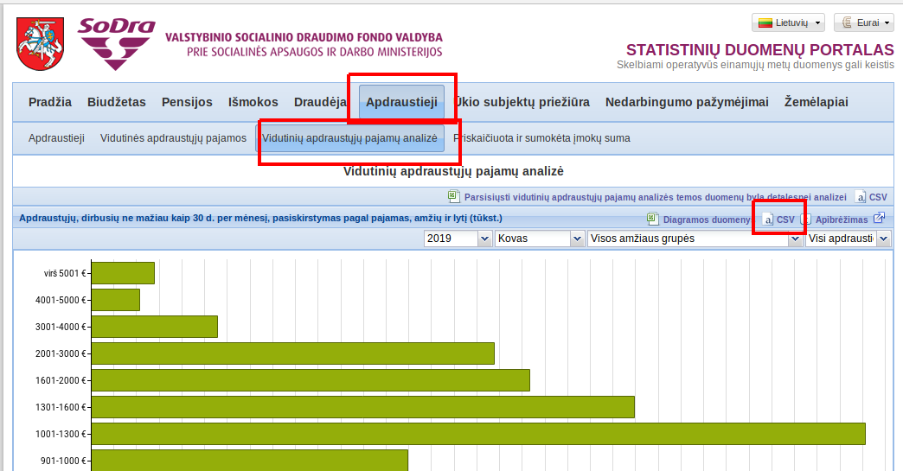

---
editor_options:
  chunk_output_type: console
output:
  pdf_document: default
  html_document: default
---
  ---
title: "Duomenų analizės įvadas"
subtitle: '3.1.. dalis - R programavimas'
author: "Justas Mundeikis"
institute: "VU EVAF"
date: "`r format(Sys.time(), '%Y-%m-%d')`"
output:
 beamer_presentation:
  includes:
   in_header: header.txt
editor_options: 
  chunk_output_type: console
---

```{r setup, include=FALSE, error=TRUE}
knitr::opts_chunk$set(echo = TRUE, collapse = TRUE)
```

## Turinys
\tableofcontents

# Natūralūs vs apdoroti duomenys
## Intro

Natūralūs duomenys (raw data) -> aprodojimo skriptas -> tvarkingi duomenys -> duomenų analizė -> komunikacija

## Natūralūs vs apdoroti duomenys

Natūralūs duomenys:

* Paimti iš duomenų šaltinio
* Ne retai sunkiai pritaikomi analizei
* Duomenų analizė ne retai apima ir duomenų apdorojimą
* Natūralius duomenis gali reikėti apdoroti vieną ar kelis kartus
[wiki:Raw_data](https://en.wikipedia.org/wiki/Raw_data)

Apdoroti duomenys:

* Duomenys paruošti analizei
* Apdorojimas gali apimti duomenų apjungimą, dalinimą, transformavimą etc.
* Priklausomai nuo aplinkybių, gali egzistuoti duomenų aprodojimo standartai
* Visi duomenų apdorojimo žingsniai turi būti dokumentuoti

## Raw to tidy

1. Natūralūs duomenys (raw data set)
2. Tvarkingi duomenys (tidy data set)
3. *Code book* (meta doumenys) tvarkingiems duomenims
4. R Skriptas (1.-> 2.)

## Tvarkingi duomenys

1. Vienas kintamasis - 1 stuleplis
2. Viena observacija - 1 eilutė
3. Vienam kintamajam - 1 lentelė
4. Daug lentelių gali būti sujungtos per vieną stulpelį
5. Pirma eilutė - žmonėms suprantami kintamųjų pavadinimai (Pajamos vs Pj)
6. Viena lentelė - vienas failas

## Code book

1. Informacija apie kintamuosus, jų matavimo vienetus (gali nebūti apdorotuose duomenyse)
2. Informacija, kaip surinkti duomenys (apklausos metodai...)
3. Informacija, kaip apdoroti duomenys
4. Pageidautina .txt failas su markdown sintakse 

## Duomenų apdorojimo skriptas

* Duomenų apdrorojimo skriptas R, Python, Stata, SPSS
* Turi priimti natūralius duomenis
* Grąžinti tvarkingus duomenis
* Skripte neturėtų būti jokių nuo vartotojo priklausomų parametrų / nustatymų
* Jeigu skripte neįmanoma automatiškai atlikti visų veiksmų, būtina detaliai aprašyti (codebook + skripte komentavimo funckija)


## Kas būna kai...

Does high public debt consistently stifle economic growth? A critique of Reinhart and Rogoff 

We replicate Reinhart and Rogoff (2010A and 2010B) and find that selective exclusion of available data, coding errors and inappropriate weighting of summary statistics  lead  to  serious  miscalculations  that  inaccurately  represent  the  relationship  between public debt and GDP growth among 20 advanced economies. Over 1946–2009, countries with public debt/GDP ratios above 90% averaged 2.2% real annual GDP growth, not −0.1% as published...

[Does high public debt consistently stifle economic growth? A critique of Reinhart and Rogoff](https://umassmed.edu/globalassets/quantitative-health-sciences/files/camb.-j.-econ.-2013-herndon-cje-bet075.pdf)

## Darbinė direktorija

* `getwd()` ir `setwd()`
* relatyvus adresas `setwd("./data")`, `setwd("../data")`
* absoliutus adresas `setwd(c:/users/studentas/desktop/test/data)` 
* nenaudokite absoliučių adresų
* INSTR: pakeisti darbinę direkrotiją į "Desktop"

## Darbinė direktorija

* `file.exists("file_name")` testuoja ar egzistuoja failas arba direktorija
* `dir.create("folder_name")` sukuria direktoriją
* jeigu skriptas importuoja duomenis, o duomenys turi būti patalpinti atksiroje direktorijoje:

```{r, eval=FALSE}
if(!file.exists("data")){
        dir.create("data")
}
```

## `paste()`

* `paste()` funkcija sujungia stringus / vectorius į vieną *character* string
```{r}
times <-"Times"; x <- 3
paste("Hello", "World", x, times, sep=" ")
paste("Hello", "World", x, times , sep = "_")
a <- c(1,2,3,4); b <- c("a", "b", "c")
paste(a,b, sep="&", collapse="%")
```

# Duomenys iš interneto
## Duomenys iš interneto

* `download.file(url, destfile, method, quiet = FALSE, mode = "w", cacheOK = TRUE, extra = getOption("download.file.extra"))`
* tinka duomenų failų parsiuntimui (.txt, .csv, etc)
* Keliaujam į [http://atvira.sodra.lt/lt-eur/](http://atvira.sodra.lt/lt-eur/) - Apdraustieji - Vidutinių apdraustųjų pajamų analizė - CSV 
* Nusikopijuojam url



## Duomenys iš interneto
```{r, collapse=TRUE, eval=FALSE}
URL <- "http://atvira.sodra.lt/csv/lt-eur/apdraustieji_3_1.csv"
Sys.time()
DownloadDate <- format(Sys.time(), format="%Y_%m_%d")
filename <- paste("./data/apdraustieji_3_1_",
                         DownloadDate,
                         ".csv", 
                         sep = "")
filename
# pastaba: method="curl" arba "wininet" kartais veikia geriau, svarbu išsibandyti
download.file(
        url = URL, 
        destfile = filename, 
        method = "auto")

```

## Duomenys iš interneto
* Dabar visą zip failą "apdraustuju_pajamu_analize.zip"


```{r, collapse=TRUE, eval=FALSE}
URL <- "http://atvira.sodra.lt/downloads/lt-eur/apdraustuju_pajamu_analize.zip"
DownloadDate <- format(Sys.time(), format="%Y_%m_%d")
filename <- paste("./data/apdraustuju_pajamu_analize_",
                         DownloadDate,
                         ".zip", 
                         sep = "")
filename
download.file(
        url = URL, 
        destfile = filename,
        method = "auto")

# jeigu daugiau nei vienas failas, nurodyti tikslų failo pavadinimą
unzip(filename,
      exdir="data",
      files = "apdraustuju_pajamu_analize.csv")
```

## Duomenys iš interneto
* sukuriamas `temp()` failas
* į jį nudownloadinamas failas
* iš temp failo išsiekstrahuojame reikiamą turinį
* kai nebereikia `unlink(...)` panaikina `temp()` failą

```{r, eval=FALSE}
URL <- "http://atvira.sodra.lt/downloads/lt-eur/apdraustuju_pajamu_analize.zip"
temp <- tempfile()
download.file(url = URL, temp, method = "auto")
GYV_PAJ <- read.csv(unzip(temp,"apdraustuju_pajamu_analize.csv"),
                 header=TRUE,
                 sep=";",
                 stringsAsFactors = FALSE) 
unlink(temp)
```

## Duomenys iš interneto
```{r, eval=FALSE}
median(GYV_PAJ$Mėnesio.pajamos)
list(lower_bound = 0.5*median(GYV_PAJ$Mėnesio.pajamos),
median= median(GYV_PAJ$Mėnesio.pajamos),
upper_bound = 2*median(GYV_PAJ$Mėnesio.pajamos))

maximum <- 4000
hist(GYV_PAJ$Mėnesio.pajamos[GYV_PAJ$Mėnesio.pajamos<=maximum],
     main="Histogram of declared labor income",
     xlab="Income grouped by 100",
     breaks=seq(0,maximum,100),
     xaxt="n")
axis(side=1, at=seq(0,maximum, 100), labels=seq(0,maximum,100))

```


## Duomenys iš interneto
* 100% tikrumo, koks failo `encoding` neduos niekas
* Geras būdas, pabandyti atsidaryti su LibreOffice Calc, Sublime
* Mažiau tiksli alternatyva `guess_encoding` iš paketo `readr`
* google
```{r, eval=TRUE}
#install.packages("readr")
library(readr)
guess_encoding("./data/apdraustuju_pajamu_analize.csv", n_max = 1000)
```


## Duomenu nuskaitymas
* `read.table`
* `read.csv` , `read.csv2`, etc
* `readr` importavimo tool'sas (generuoja R kodą)

```{r, eval=TRUE}
df <- read.table("./data/apdraustuju_pajamu_analize.csv",
                 header=TRUE,
                 sep=";",
                 fileEncoding = "ISO-8859-13",
                 stringsAsFactors = FALSE) 
```

## Galvos skausmas Excel formatai
* iš Sodros
* parsisiunčiam `.xlsx` failą
```{r, eval=FALSE}
URL <- 
"http://atvira.sodra.lt/downloads/lt-eur/apdraustuju_pajamu_analize.xlsx"
DownloadDate <- format(Sys.time(), format="%Y_%m_%d")
download.file(url = URL, 
              destfile = paste("./data/apdraustuju_pajamu_analize_",
                               DownloadDate,
                               ".xlsx", 
                               sep = ""), 
              method = "auto")
```

## Galvos skausmas Excel formatai
* `readxl` paketas
* `xlsx` paketas
* alternatyva atsidaryti su Excel, išsaugoti kaip `.csv`, importuoti kaip `.csv`
```{r, eval=FALSE}
#install.packages("readxl")
library(readxl)
# su Excel pasitikriname, kurį sheet importuosime
df2 <- read_excel(".data/apdraustuju_pajamu_analize_2019_05_08.xlsx", 
                  sheet = "Duomenys")
str(df2)
```


## Galvos skausmas Excel formatai
* `write_excel_csv()` su `readr` paketu
* `write.xlsx` su `openxlsx` paketu
* SVARBU! Excel neatidaro daugiau nei 
* 1 048 57 eilučių ir 16 384 stulpelių

```{r, eval=FALSE}
install.packages("openxlsx")
library(openxlsx)
l<-list(iris=iris, mtcars=mtcars, quakes=quakes)
write.xlsx(l, file = "./data/datasets.xlsx")
```

## LSD
* LSD sukelia daug galvos skausmų, tačiau LSD turi API 
* ["RESTful žiniatinklio paslaugos"](https://osp.stat.gov.lt/rdb-rest)
*`rsdmx` paketas sutvarko LSD failus

```{r,eval=TRUE}
#install.packages("rsdmx")
library(rsdmx)
```


## LSD 
Pavyzdžiai:
* kai norima gauti duomenų rinkinių sąrašą
* https://osp-rs.stat.gov.lt/rest_xml/dataflow/
* kai norima gauti konkretaus duomenų rinkinio apibrėžimą 
* https://osp-rs.stat.gov.lt/rest_xml/dataflow/LSD/S3R629_M3010217
* kai norima gauti duomenų struktūros apibrėžimą 
* https://osp-rs.stat.gov.lt/rest_xml/datastructure/lsd/M3010217/

```{r, eval=FALSE}
#metadata
url_meta <- "https://osp-rs.stat.gov.lt/rest_xml/dataflow/"

meta <- readSDMX(url_meta)
meta <- as.data.frame(meta)

write.csv(meta, "./data/meta.csv")
write.xlsx(meta, file = "./data/meta.xlsx")
```


## LSD
* išsirinkus kokio kintamojo reikia

```{r, eval=FALSE}
# S3R838 - Deaths by cause of death
# Age (5 year groups) | Causes of death (27) | Sex (2000 - 2016)
S3R838_M3010608<- readSDMX(providerId = "LSD", 
                           resource = "data", 
                           flowRef = "S3R838_M3010608", 
                           dsd = TRUE)
S3R838_M3010608 <- as.data.frame(S3R838_M3010608 , 
                                 labels = TRUE)
```

## RSDMX
* padeda imporuoti ir duomenis iš OECD, Eurostat ir kitų šaltinių, kuriuose duomenys pateikiami XML formatu
* žr. [https://github.com/opensdmx/rsdmx](https://github.com/opensdmx/rsdmx)

## Eurostat
* `eurostat` paketas
* google "eurostat cheatsheet"
* einam į Eurostat database išsirinkt duomenų...

```{r, eval=FALSE}
#install.packages("eurostat")
library(eurostat)
nama_10_gdp <- get_eurostat("nama_10_gdp", stringsAsFactors = FALSE)
```

# Duomenų inspektavimas
## Inspection
```{r, collapse=TRUE, eval=TRUE}
head(df,2)
tail(df,2)
```

## Inspection
```{r, collapse=TRUE, eval=TRUE}
str(df)
```

## Inspection
```{r, collapse=TRUE, eval=TRUE}
summary(df)
```

## Inspection
```{r, collapse=TRUE, eval=TRUE}
quantile(df$Mėnesio.pajamos)
quantile(df$Mėnesio.pajamos, probs = seq(0,1,0.1))
table(df$Lytis)

sum(is.na(df$Mėnesio.pajamos))
```


## Inspection
```{r, collapse=TRUE, eval=FALSE}
table(df$Lytis, df$Amžius)
```


## Subsetting
* užsiloadinam dataframe "mtcars"
```{r, eval=FALSE}
df <- mtcars
df[c(1:3),]
df[c(1:3),c("mpg", "cyl", "hp")]
```

## Subsetting
* užsiloadinam dataframe "mtcars"
```{r, eval=TRUE}
df <- mtcars
df[(df$mpg>=10 &
        df$mpg<=20& df$hp>=250 | df$qsec <=16), ]
```


## Subsetting
* `which()` grąžina skaitinį vektorių priimdamas loginį vektorių

```{r, eval=TRUE}
a <- c(1,NA,20,NA,40)
which(is.na(a)) #
which(!is.na(a))
a[which(!is.na(a))]

which(df$mpg<=14)
df[which(df$mpg<=14),1:3]
```

## Sorting

* `sort()` sortiruoja vektorius arba df
* tačiau veikia tik su vienu kintamuoju
* 2+ kintamųjų -> `order()`

```{r, eval=TRUE}
a <- c(1,NA,20,NA,40)
sort(a)
sort(a, decreasing = TRUE)
sort(a, decreasing = TRUE, na.last = TRUE)
head(df[order(df$mpg,df$hp),],3)
```


## Naujų stulpelių sukūrimas
* `ifelse(condition, value_true, value_false)` 
* priima vektorius! `if(){}else{}` vertina tik pirmą elementą

```{r, eval=TRUE}
mean(df$mpg)
df$loginis <- ifelse(df$mpg>=mean(df$mpg),"daugiau","mažiau")
head(df,3)

# alternatyva su cbind
# df <- cbind(df, loginis=ifelse(...)
```


## Cross tabs
* Nusiskaitom kitą `df` ir `df2` priskiriame "susiaurintą" df versiją
* Linuxe  ir MAC 
```{r, eval=TRUE, collapse=TRUE}
df <- read.csv("data/apdraustieji_3_1_2019_05_08.csv",
                 header=TRUE,
                 sep=";",
                 stringsAsFactors = FALSE) 

df2 <- df[(df$Metai==2018 & 
                   df$Mėnesio.pajamos=="401-450 €"&
                   df$Amžius=="Visos amžiaus grupės"&
                   df$Lytis!="Visi apdraustieji"), ]
```

## Cross tabs
* Create a contingency table (optionally a sparse matrix) from cross-classifying factors, usually contained in a data frame, using a formula interface.
```{r, eval=F}
table <- xtabs(data=df2,
               Apdraustųjų.skaičius ~ Lytis + Mėnuo,  
               drop.unused.levels = TRUE)
table
```


## Cross tabs
* Create a contingency table (optionally a sparse matrix) from cross-classifying factors, usually contained in a data frame, using a formula interface.
```{r, eval=F}
table <- xtabs(data=df2,
               Apdraustųjų.skaičius ~ Lytis + Mėnuo,  
               drop.unused.levels = TRUE)
barplot(table)
```


## Cross tabs

```{r, eval=F}
men <- c(Sausis=1,Vasaris=2,Kovas=3,
         Balandis=4,Gegužė=5,Birželis=6,
         Liepa=7,Rugpjūtis=8,Rugsėjis=9,
         Spalis=10,Lapkritis=11,Gruodis=12)
df2$men <- men[df2$Mėnuo]
table <- xtabs(data=df2,
               Apdraustųjų.skaičius ~ Lytis + men,  
               drop.unused.levels = TRUE)
```

## Cross tabs
```{r, eval=F}
barplot(table)
```

## Cut
* `cut()` - cut divides the range of x into intervals and codes the values in x according to which interval they fall.
* `cut()` - sukuria faktorius

```{r, eval=F}
# cut(GYV_PAJ$Mėnesio.pajamos)
table(cut(GYV_PAJ$Mėnesio.pajamos, breaks=quantile(GYV_PAJ$Mėnesio.pajamos)))

#install.packages("Hmisc")
library(Hmisc)
table(cut2(GYV_PAJ$Mėnesio.pajamos, g=4))
```

## Cut
* `cut2()` iš `Hmisc`
* sukuriame naują stulelį su kvantiliodydžio
* bei kitą stulpelį su kvantilio numer išnauydojant `as.numeric`
```{r, eval=F}
library(Hmisc)
GYV_PAJ$fact <-cut2(GYV_PAJ$Mėnesio.pajamos, g=4)
GYV_PAJ$fact_num <-as.numeric(cut2(GYV_PAJ$Mėnesio.pajamos,, g=4))
```

## Kitos bazinės funkcijos
* `abs(x)` absoliuti vertė
* `sqrt(q)` šaknis
* `ceiling(x)` suapvalinimas į viršų
* `floor(x)` suapvalinimas žemyn
* `round(x, digits=n)` suapvalinimas iki n ženklų
* `sin(x)`, `cos(x)`, `tan(x)`
* `log(x)`, `log2(x)`, `log10(x)`
* `exp(x)` e^x


## reshape2 - melt

```{r, eval=TRUE}
library(reshape2)

mtcars$car_name <- rownames(mtcars)
mtcars_melt <- melt(mtcars, id=c("car_name", "gear", "cyl"), measure.vars = c("mpg", "hp"))
```

## reshape2 - melt

```{r, eval=TRUE}
head(mtcars_melt,3)
tail(mtcars_melt,3)
```

## Cast 
* Use `acast` or `dcast` depending on whether you want vector/matrix/array output or data frame output. Data frames can have at most two dimensions.

```{r}
# length = count
dcast(mtcars_melt, cyl~variable)
acast(mtcars_melt, cyl~variable)
```

## Cast 

```{r}
dcast(mtcars_melt, cyl~variable, mean)
dcast(mtcars_melt, gear~variable, mean)
```

## tapply

```{r}
tapply(mtcars$mpg,mtcars$cyl,mean)
tapply(mtcars_melt$value, mtcars_melt$variable, mean) 
```

## merge

```{r, eval=FALSE}
set.seed(101)
a <- data.frame(id=sample(1:10), name=sample(letters[1:10],10), val1=sample(3,10,replace = T))
b <- data.frame(id=sample(1:10), name=sample(letters[1:10],10), val2=sample(3,10,replace = T))
a
b
```

## merge

```{r, eval=FALSE}
names(a)
names(b)
intersect(names(a), names(b))
merge(a,b)
merge(a,b,all = TRUE)
merge(a,b,by.x="id", by.y = "id")
```


# dplyr
## dplyr
* Sukurtas Hadley Wickham @Rstudio
* pagerinta `plyr` paketo versija
* pagerina naudojimąsi R
* veikia labai greitai, nes DF aprodojimas perkoduotas į `C++`

## dplyr
* select
* filter
* arrange
* rename
* mutate
* summarize
* pipe `%>%`

## select
```{r, eval=FALSE}
library(dplyr)

head(nama_10_gdp)
head(select(nama_10_gdp, 1:3))
head(select(nama_10_gdp, unit, geo, values))
select(nama_10_gdp, -(1:3))
```


## filter
```{r, eval=FALSE}
filter(nama_10_gdp, geo=="LT")
df <- filter(nama_10_gdp, geo=="LT" &
               na_item=="B1G" &
               unit=="CLV10_MEUR"&
               time>="2000-01-01")
plot(df$values, type="l")
```

## arrange
```{r, eval=FALSE}
df <- arrange(df, time)
plot(df$values, type="l")

#df <- arrange(df, desc(time))
#plot(df$values, type="l")
```

## rename
* `new_name=old_name`

```{r, eval=FALSE}
df <- rename(df, rodiklis=na_item)
head(df)
```

## mutate
```{r, eval=FALSE}
df <- mutate(df, mean=mean(df$values))
head(df)
plot(df$values, type="l")
lines(df$mean)
```

## summarize
```{r, eval=FALSE}
df <- filter(nama_10_gdp, 
             na_item=="B1G" &
             unit=="CLV10_MEUR"&
             time>="2000-01-01")

df_g <- group_by(df, geo)

summarise(df_g, mean=mean(values), median=median(values))
```


## piping
* `%>%` 
```{r, eval=FALSE}
df <- nama_10_gdp %>%
       filter(geo=="LT" &
               na_item=="B1G" &
               unit=="CLV10_MEUR"&
               time>="2000-01-01")%>%
        select(time, values) %>%
        mutate(mean_LT=mean(values))%>%
        arrange(time)

plot(df$values, col="red", type="l")
lines(df$mean_LT, col="blue")

```

