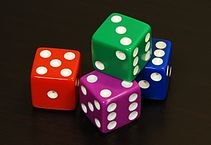
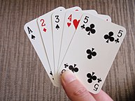

```{r setup, include=FALSE}
knitr::opts_chunk$set(echo = TRUE, collapse = TRUE, error = TRUE, cache = TRUE, fig.pos = 'h')
library(gridExtra)
```

# Nesažiningų kauliukų Casino


## Įvadas
Šio užsiėmimo tiklsai:
    * susipažinti su kai kuriomis naujomis funkcijomis
    * įprasti rašyti nuosavas funkcijas
Šis užsiėmimas remiasi "Hands-On Programming with R" (Garett Grolemund)
Šio užsiėmimo metu sukonstruosime funkciją, kuri imituos sžiningo kauliuko metimą, kai galėsime mesti kauliukus ir gauti atsitiktinius skaičius. Tačiau norėdami užsidirbti daug pinigų, šiek tiek tweakinsim kauliukus, jog jie būtų labiau mūsų, t.y. Casino, naudai.


## Prisiminimui
Sukurkime objektą
Priminimas: objektų pavadinimai negali prasidėti skaičiumi, $, ^ bei kitais aritmetiniais simboliais
```{r}
kauliukas <- 1:6
kauliukas
```

Siekiant sužinoti, kokius objektus jau esame sukūrę ir kurie yra mūsų darbo atmintyje, galime naudooti `ls()` komandą (panašiaip kaip ir CLI)
```{r}
ls()
```

R atlieka vektorizuotas operacijas, todėl galime naudoti panašias komandas:
```{r}
kauliukas - 1
kauliukas * 2
kauliukas / 3
kauliukas * kauliukas
```

Tačiau atsargia su *vector recycling*, jeigu vienas vektorius yra turmpesnis už kitą, R jį perkramtys ir panaudos tiek, kad atliktų visas reikalingas matematines operacijas.
```{r}
kauliukai + c(1,2,3)
kauliukai + c(1,2,3,4)
```

## Funkcijos

Funkcijos priima argumentus
```{r}
mean(1:6)
mean(kauliukas)
round(pi)
round(mean(kauliukas))
```

Norint galėti mesti kauliukus, galima naudotis funkcija `sample`
```{r}
sample(x=1:4, size = 2)
sample(kauliukas, size = 1)
sample(kauliukas, size = 1)
sample(kauliukas, size = 1)
sample(kauliukas, size = 1)
```

Jeigu pamirštate, kokius argumentus priima funkcija, galite naudotis `args()` funkcija
```{r}
args(round) #čia jau predefinuotas, jog apvalinimas vyktų iki 0 ženklų po kablelio
round(pi, digits=1)
round(pi, digits=2)
round(pi, digits=3)
args(sample)
sample(size=1, kauliukas)
sample(kauliukas, size=6)
sample(kauliukas, size = 6, replace = TRUE)
```

Tarkime "kauliukai" tai  išmestų dviejų kauliukų suma
```{r}
kauliukai <- sample(kauliukas, size=2, replace = TRUE)
kauliukai
sum(kauliukai)
# jeigu dabar kelikart iššauksime metimas:
kauliukai
kauliukai
kauliukai
#kaskart gausime jau išsaugotas metimas reikšmės
```

### Uždavinys
#### Užduotis
Parašykite funkciją `metimas()`, kuri išmestų ir susumuotų išmestų 2 kauliukų sumą. Priminimui:
```{r, eval=FALSE}
kauliukas <- 1:6
kauliukai <- sample(kauliukas, size=2, replace = TRUE)
sum(kauliukai)
```
#### Sprendimas
```{r}
metimas <- function(){
        kauliukas <- 1:6
        kauliukai <- sample(kauliukas, size=2, replace = TRUE)
        sum(kauliukai) #svarbu iššaukti rezultatą
}

metimas()
metimas()
metimas()
```
### Ir dar
Jeigu pakeisime funkciją iš `sample(kauliukas...` į `sample(kaulas...`
```{r}
metimas2 <- function(){
        kauliukai <- sample(kaulas, size=2, replace = TRUE)
        sum(kauliukai) 
}

metimas2()
```

Bet galime perrašyti funkciją taip
```{r}
metimas2 <- function(kaulas){
        kauliukai <- sample(kaulas, size=2, replace = TRUE)
        sum(kauliukai)
}
# funkcija neveiks nenurodant kaulas argumento
metimas2()
# dabar funkcija veiks, jeigu argumentui bus priskirtos reikšmės
metimas2(kaulas=1:4)
metimas2(kaulas=1:10)
metimas2(kaulas=100:200)
```

Jeigu norime, galime predefinuoti, kas yra "kaulas" t.y. argumentui kaulas priskirti iš anskto numatytas reikmšes
```{r}
metimas2 <- function(kaulas=1:6){
        kauliukai <- sample(kaulas, size=2, replace = TRUE)
        sum(kauliukai) #svarbu iššaukti rezultatą
}
metimas2()
```

## Grafikai
Sugeneruojame du vektorius:
* x ašį
* ir y=x^3 funkcijos vertes
```{r}
x <-  seq(from=-1, to=1, by=0.2)
y <- x^3
```

Dabar galime nubraižyti jų grafiką
```{r, fig.height=4, fig.width=4, fig.align='center'}
plot(x,y)
```

Galime sugeneruoti ir histogramą:
```{r, fig.height=3, fig.width=9, fig.align='center'}
x <- c(1,2,2,2,2,3,3)
par(mfrow=c(1,2))
hist(x)
hist(x, breaks = c(0:5))
```

### Uždavinys
#### Užduotis
funkcija `rnorm()` generuoja normaliojo skirstinio skaičius. Jeigu reikia pagalbos, `?rnorm`.
Nubraižykite 100 verčių iš normaliojo skirstinio, kurio vidurkis =100, o standartinis nuokrypis 1, histrogramą.
Histogramos x ašies vertės turėtų būti:
    * nuo mažiausios x vertės suapvalinus  žemyn  `min()`
    * iki didžiausios x vertės suapvalinus į viršų `max()`
    * skirtumas 1
Pagalba dėl apvalinimo `?round`

#### Sprendimas
```{r, fig.height=4, fig.width=4, fig.align='center'}
x <- rnorm(n = 100, mean = 100, sd = 10)
hist(x, 
     breaks =seq(from=floor(min(x)), 
                 to=ceiling(max(x)), 
                 by=1)
)
```


### Funkcijos replikavimas (=sapply)
Grįžkime prie mūsų lošimo.

Komanda `replicate()` leidžia kartoti tam tikrą R komandą norimą kartų kiekį, arba pvz pakartoti tam tikrą verktoriu.
Pastaba `replicate(n, expr,...)= sapply(1:n, function(x) call)`
```{r}
args(replicate)
# pvz pakarotja 3 kartus komanda 1+1
replicate(3, 1+1)

#pakartojame 10 kartų metimas() funkciją
replicate(10, metimas())
```

### Užduotis
#### Uždavinys
Jeigu būtume sąžiningas Casino, kaip atrodytų daugybės metimų skirstinys (metimas= 2 išmestų kauliųkų suma)?
Pasinaudodami `replicate()` funckija, nubraižykite histogramą metimo sumų, jeigu funckija metimas būtų pakartota 10 000 kartų

#### Sprendimas
```{r}
# jeigu vidurkis vieno kauliuko:
mean(1:6)
# tai dvejų kauliukų expected value (matematinė viltis) = vidurkis
2*mean(1:6)

```

```{r, fig.height=4, fig.width=4, fig.align='center'}
skirstinys <- replicate(10000, metimas())
hist(skirstinys, breaks = seq(from=0, to=12, b=1))
```

Na bet būti sąžiningu Casino? Kur tai matyta...
Ką reikia pakeisti?

```{r}
metimas <- function(){
        kauliukas <- 1:6
        kauliukai <- sample(kauliukas, size=2, replace = TRUE, prob = c(rep(1/8,5), 3/8))
        #prob = c(rep(1/8,1/8,1/8,1/8,1/8, 3/8))
        sum(kauliukai) #svarbu iššaukti rezultatą
}
```

Kaip atrodo tokių "pagerintų kauliukų" matematinės vilties skirstinys?

```{r, fig.height=4, fig.width=4, fig.align='center'}
skirstinys <- replicate(10000, metimas())
hist(skirstinys, breaks = seq(from=0, to=12, b=1))
mean(skirstinys)
```

# Black Jack



## Įvadas

Šio užsiėmimo tiklsai:
    * pasikartoti skirtingus R objektus, 
    * subsetting, 
    * keisti reikmšes objektuose
Šis užsiėmimas remiasi "Hands-On Programming with R" (Garett Grolemund)
Šio užsiėmimo metu ...

